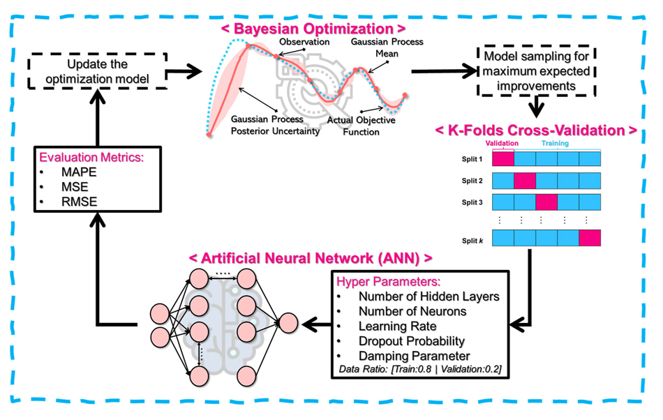

# Battery Capacity Prediction with Optimized ANN

This repository contains MATLAB code for reading structured battery cycling data and using it to train an artificial neural network (ANN) for capacity prediction. The ANN model employs hyperparameters optimized via Bayesian optimization, built using MATLAB's Deep Learning Toolbox.
This script was used in the paper titled:

“Computational Micromechanics and Machine Learning-Informed Design of Composite Carbon Fiber-Based Structural Battery for Multifunctional Performance Prediction,” published in ACS Applied Materials & Interfaces.

The code provides a reproducible and modular framework for feature extraction, normalization, ANN training, and capacity forecasting — making it suitable for both academic study and real-world applications in battery health monitoring.

  

---

Features
- Loads .mat structured battery data created from BMS logs.
- Extracts and visualizes voltage/current for any cycle.
- Processes capacity degradation profiles across charge-discharge cycles.
- Normalizes inputs and outputs for improved training stability.
- Implements ANN training using manually set or optimized hyperparameters.
- Predicts future cycle capacities and evaluates prediction error (MAPE).

---

Implementation Details

Prerequisites
- MATLAB with the Deep Learning Toolbox installed.
- Structured .mat battery file (e.g., SPE40_0p1C.mat) generated from the Data Structuring script.

Example Dataset
The script expects a file like SPE40_0p1C.mat with a .cycles structure containing current, voltage, and capacity data.

---

Usage

Steps to Run the Code
- Open the MATLAB script.
- Ensure the structured data .mat file is available in the directory.
- Run the script to perform preprocessing, model training, and evaluation.
- The script is split into clearly labeled sections for visualization, extraction, training, and prediction.

Key Steps Performed by the Code

1. Data Loading
   - Reads in structured .mat battery file.

2. Visualization
   - Plots voltage and current profiles for selected cycles.

3. Feature Extraction
   - Uses helper functions (extract_discharge, extract_charge_preprocessing) to retrieve and prepare input data.

4. Normalization
   - Performs min-max scaling for input/output values.

5. ANN Model Setup
   - Defines architecture (hidden layers, dropout, learning rate, etc.) either manually or via optimized settings.

6. Training & Validation
   - Splits data into train/validation/test sets.
   - Trains ANN using train function with custom division.

7. Prediction & Evaluation
   - Generates capacity predictions.
   - Denormalizes predicted values and compares with actual capacity data.
   - Outputs MAPE (Mean Absolute Percentage Error) and training MSE.

---

Output

Prediction Results
- Cycle-wise capacity prediction curves (Real vs. Predicted).
- Final prediction performance metrics printed in the console:
  - Mean Absolute Percentage Error (MAPE).
  - Mean Squared Error (MSE) during training.

Figures and Diagnostics
- Voltage/Current plots.
- Capacity degradation profile.
- Predicted vs. actual capacity comparison.

---

Typical Applications
- Health monitoring and remaining useful life (RUL) estimation of batteries.
- Training battery management system (BMS) intelligence layers.
- Exploring the coupling between electrical behavior and mechanical degradation in multifunctional batteries.

---

Citation
If you use this code in your research or publications, please cite the associated work:

M. A. Raja, W. Kim, W. Kim, S. H. Lim, and S. S. Kim,
“Computational Micromechanics and Machine Learning-Informed Design of Composite Carbon Fiber-Based Structural Battery for Multifunctional Performance Prediction,”
ACS Applied Materials & Interfaces, vol. 17, no. 13, pp. 20125–20137, Feb. 2025. doi:10.1021/acsami.4c19073

---

License
This project is licensed under the MIT License. See the LICENSE file for more details.
